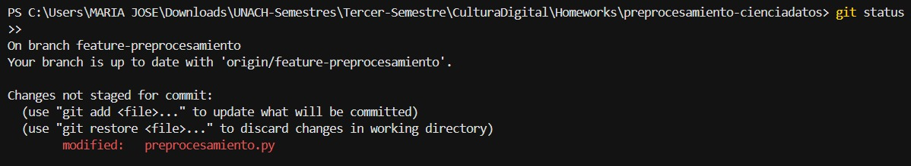
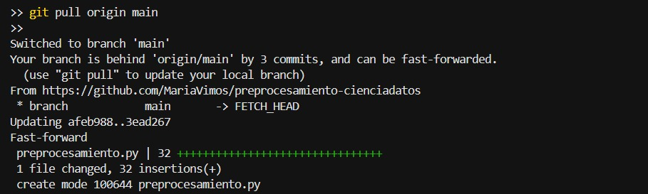
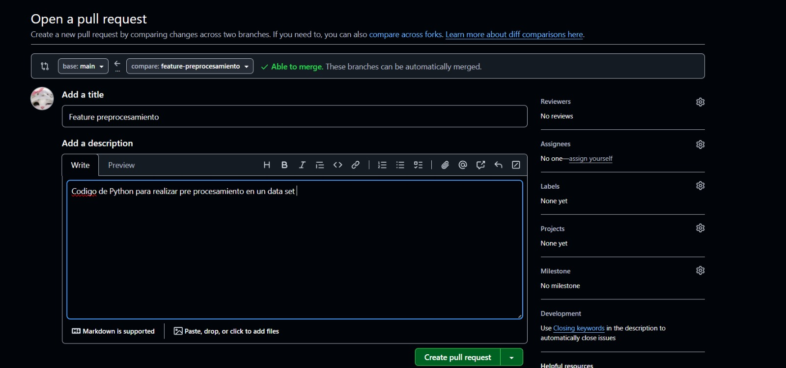
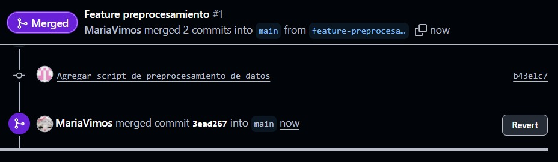
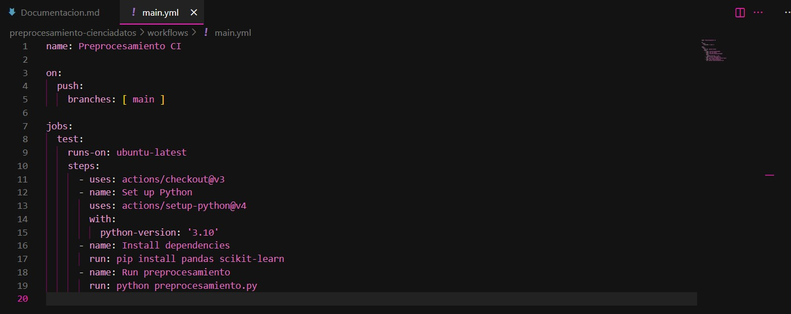
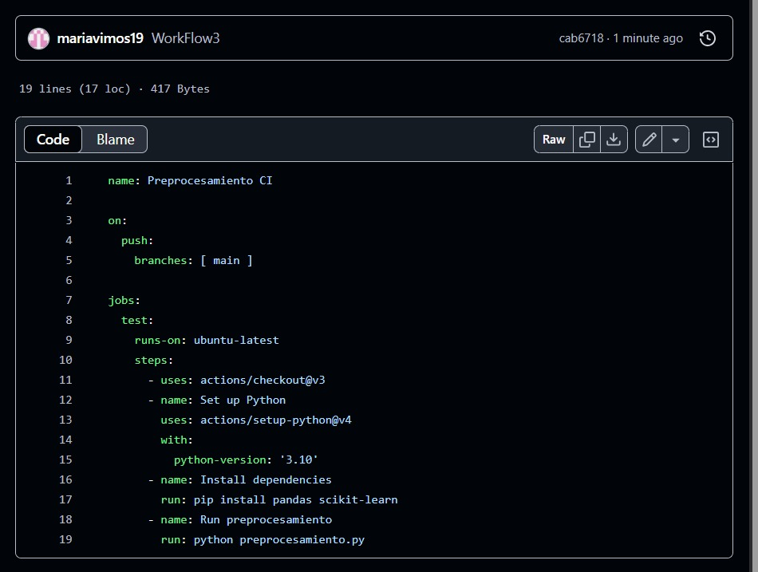

### PREPROCESAMIENTO DE DATOS 

El proyecto tipreprocesamiento cienciadatos tiene como objetivo aplicar el uso de Git y Github para la gestion y colaboracion en proyectos de ciencia de datos donde se implementa un preprocesamiento completo de datasets usando la biblioteca de Pandas , incluye:

- Gestion de valores nulo
- Eliminacion de valores duplicados 
- Normalizacion de las columnas
- Codificaion de variables categoricas

Nos permite preparar datasets para analisis de modelos machine learning asegurandonos datos limpios y consistentes.

**COMANDOS UTILIZADOS:**

Git init : Inicializa un repositorio git en la carpeta local

Git add: Agregar todos los archivos nuevos

GIt comit -m: Guarda los cambios en el historial de git con un mensaje descriptivo

Git Push: Sube los cambios locales a la rama de GitHub

Git checkout: Crea y tambien cambia una nueva rama

Git pull origin main: Actualiza la rama local main con los ultimos cambios

Git brach : Elimina una rama local despues de fusionarla

**PULL REQUEST Y FUSION**

- Primero se creo una rama feature-preprocesamiento para trabajar en las rama
-  Se subio la rama a GitHub usando git push origin feature-preprocesamiento 
- Se creo un Pull Request caomparando feature-preprocesamiento con main 
- Revisamiento de la PR y se acepta la fusion usando Merge pull request
- Se elimino la rama feature-preprocesamiento tanto en GitHub como localmente 

**AUTOMATIZACION CON GITHUB ACTIONS**

Se creo un wokflow basico que ayuda a verificar la ejecucion de preprocesamiento.py cada vez que se hace un push o main
- Cada vez que se usa psuh o main se activa
- Instala Python3.10
- Instala las dependencias necesarias pandas y scikit learn
- Ejecuta el archivo 

**EVIDENCIAS**

**ENLACE DEL REPOSITORIO:**

https://github.com/MariaVimos/preprocesamiento-cienciadatos.git